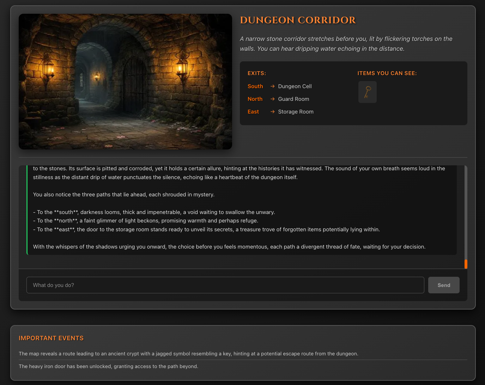

# Interactive Fiction

> ⚠️ **Work in progress.** This is an early prototype. Interfaces, game content, and
> architecture are all subject to change, and there is no stability guarantee between
> commits. Expect rough edges.

An AI-powered text adventure: a dungeon-escape interactive fiction game where a language
model acts as the Game Master, narrating scenes and responding to free-form player input.



## What it does

Instead of matching player input against a fixed verb list, the game sends each action to
an LLM that narrates the outcome and returns structured events (`ADD_INVENTORY`,
`CHANGE_SCENE`, `LOG_MEMORY`, …) which the client applies to game state. A vector store
gives the narrator long-term memory, so it can call back to things you discovered many
turns earlier and stay consistent when re-asked a question.

## Architecture

```
frontend/   React 19 + Vite game client
backend/    Express API — validation, AI orchestration, session state
```

**Request flow**

1. The player's action hits the backend, which first passes it to **Anthropic Haiku** as a
   guardrail — actions that are impossible, anachronistic, or off-tone are rejected in
   character before any expensive call is made.
2. Surviving actions are embedded and used to search **Qdrant** for the most relevant past
   memories, which are injected into the Game Master system prompt.
3. **OpenAI GPT-4o-mini** generates the narrative plus a strict JSON schema of game events,
   streamed back to the client.
4. New plot points are embedded back into Qdrant for future recall.

## Requirements

- Node.js >= 18
- Docker (for Qdrant)
- API keys for OpenAI and Anthropic

## Setup

```bash
# 1. Vector store
docker compose up -d qdrant

# 2. Backend
cd backend
cp .env.example .env      # then fill in your API keys
npm install
npm run dev               # http://localhost:3001

# 3. Frontend
cd ../frontend
cp .env.example .env
npm install
npm run dev               # http://localhost:5173
```

The backend degrades gracefully if Qdrant is unavailable — the game still runs, but the
narrator loses its long-term memory.

## Configuration

Secrets live in `backend/.env` only, and are never exposed to the browser:

| Variable | Where | Purpose |
| --- | --- | --- |
| `OPENAI_API_KEY` | `backend/.env` | Narrative generation + embeddings |
| `ANTHROPIC_API_KEY` | `backend/.env` | Input validation guardrail |
| `QDRANT_URL` | `backend/.env` | Vector store (default `http://localhost:6333`) |
| `PORT` | `backend/.env` | Backend port (default `3001`) |
| `FRONTEND_URL` | `backend/.env` | CORS origin |
| `VITE_BACKEND_URL` | `frontend/.env` | Backend URL for the client |

> Never put an API key in a `VITE_`-prefixed variable — Vite inlines those into the client
> bundle, making them public to anyone who loads the page.

## Commands

```bash
# frontend
npm run dev       # dev server
npm run build     # production build
npm run lint      # eslint
npm run preview   # preview the build

# backend
npm run dev       # nodemon, hot reload
npm start         # production
```

> Note: `npm test` is wired up to `node --test`, but no test files exist yet.
> Building out a test suite is on the list.

## Known limitations

- **Production builds are not asset-complete.** Scene and item art is referenced by
  dev-server paths (`/src/assets/...`), which Vite does not rewrite at build time, so
  `npm run build` currently produces a version with missing images and audio. Run the dev
  server to see the game as intended.
- No automated tests yet.
- Sessions are stored as local JSON files, so they do not survive a container rebuild
  unless the volume is preserved.

## Status

| Area | State |
| --- | --- |
| Core game loop | Working |
| AI guardrail validation | Working |
| RAG / long-term memory | Working |
| Response streaming | Working |
| Session persistence | Local file storage |
| Auth, multiplayer, progression | Not started |

## License

Not yet specified.
